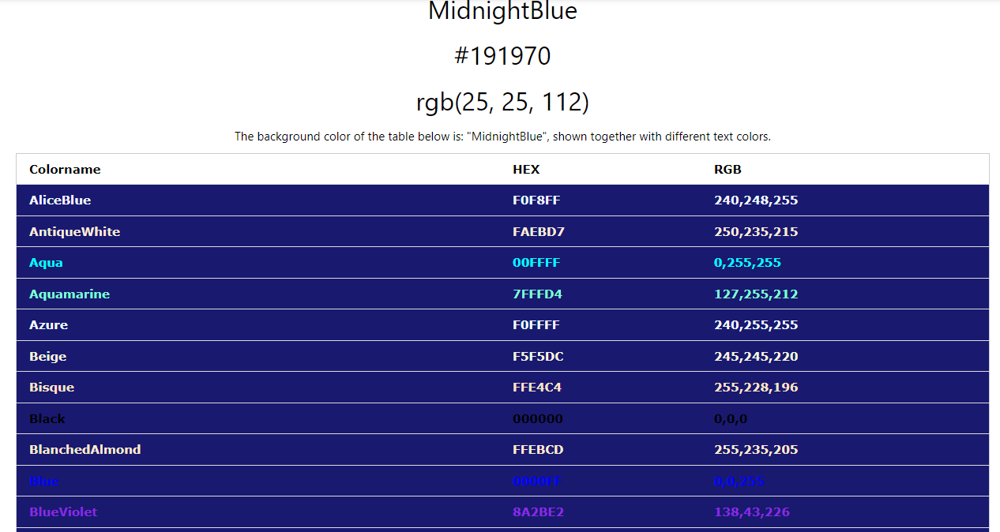
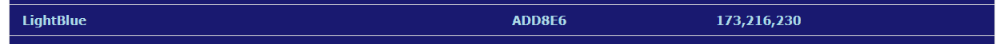

# Tic-Tac-Toe-Time - A JavaScript Project

add image of site responsivness 

This is my second milestone project, undertaken as part of the Code Institutes Diploma in Software Development.
Here is the link for [Tic Tac Toe Time](https://jessmair.github.io/Tic-Tac-Toe-Time/)

#  Who Is This Website For?

I have created this site for game enthusiast that enjoy simple classics such as this game "Tic Tac Toe". Better known as "Naughts and Crosses" outside of America. 
The games origins can be traced back to ancient Egypt and has enjoyed variations of the same game through the ages. 
Although I suspect most will recall playing this classic at some point in their childhood with a pencil and some paper. 
I certainly do recall playing this game, with friends, sibling, parents and grandparents. The beauty of this game is that it requires to players and yet can be learned by almost everyone. A game that has been shared and played over the ages, between friends and families, I hope you enjoy visiting the site and maybe you will reminse the days when you played a simple game of Tic Tac Toe. 

# UX - User Experience 

The project was planned in 5 stages. 

- Strategy Plane 

- Scope Plane 

- Structure Plane

- Skeleton Plane

- Surface Plane 

# The Strategy Plane 

## User Stories
-   As a user I want to be able to play the game with another person who is present in person with me
-   As a user I want see a clear set of instructions 
-   As a user I want to experience a simplistic user interface 
-   As a user I want to be able to easily navigate the game
-   As a user I want to be able to play the game repeatedly and as seamlessly as possible
-   As a user I do not want the site to be cluttered or have any information that does not serve a clear purpose in allowing me to play the game 
-   As a user I want the site to be easy to learn so that when I return in the future, the sites layout simple and easy to memorise 
-   As a user I want to be able to play this game on my mobile device and for the format to remain tidy at all times 

## The Owner 

-   The game should have easy to understand instructions
-   The game should be a 2 player game to be played when both player are present together, using the same device, taking turns when it is their go
-   The gameboard needs to be easy to access 
-   The user should be able to intuitively navigate the game with easy to follow game cues 
-   The functions of the game should be self-explanotory
-   I want the site to be fully responsive on a mobile screen as a key objective, thus making this game accesible if people wishes to play it on their phone  

# The Scope Plane

The features of this project:

1 page
A set of instructions 
A boardgame 
Markers that appear when the mouse is hovered over the board to allow the player to visualise which cell to place their marker in, as per their turn
A "not allowed" symbol to appear when a player hover over an already occupied cell 
A message at the end of a game, notyfying of either a winner or a draw between the players
A "Restart" button, that when pressed resets the board for a new game
  
# The Structure Plane 

The website only has one page. The page contains the title, instructions and the boardgame itself. 
The goal of this page is to be very easy to understand and digest. Also for someone who is familiar with the classic game of Tic Tac Toe, to be able to go straight to playing the game. 

ADD IMAGE OF THE PAGE WITH GAME HALF PLAYED 

The colour of the background and the detail is complimentary and not too bright or dark, creating a good contrast and yet complienting eash other. 
The instructions are not overly wordy so that the game is quick and easy to move on to. 
The board is interactive too as it register a click and also prevents the player from being able to click on a cell that is occupied 

IMAGE OF WINNER PAGE 
This image shows the screen that shows conatining a message of which player won, "X" or "O". The "Restart" button is interactive.

IMAGE OF DRAW PAGE  
This image shows when the game ends in a draw. The "Restart" button is interactive. 

IMAGE OF GAME RESET 
This image shows the screen after the "Restart" button is pressed. A clean boardgame is visible. 

# The Skeleton Plane 

The design of this project was to make the content simplistic and one of the key objectives was to make the site fully responsive to a mobile screen size, as well as the bigger screen sizes. The reason being that such games are more likely to be played on mobile phones than on desktops for example.

Below is a link to the wireframes I had completed

PAGE 1

PAGE 2 

# The Surface Plane

## Colour Palette

I used the site w3schools.com's "CSS-Colours" section to select a colour combination. I used the above "Midnight Blue" as the primary colour as it is dark and would create a contrast to the secndary colour I selcted.

The light blue has been used for the details of the page such as the board game, the markers and the slightly trasnparent cover that displays in between game that displays the notification of the game's outcome. 
I found these two colour to be complimenatry whilst still mainting a strong enough contrast to maintain the sites accesibility to all people. 

## Font

I have used google fonts and chose 1 font called "League Gothic". I found this font to be sharp and clear whilst imparting a nostalgia. This is something I think is fitting for a game such as Tic Tac Toe, as it is a true classic.  

