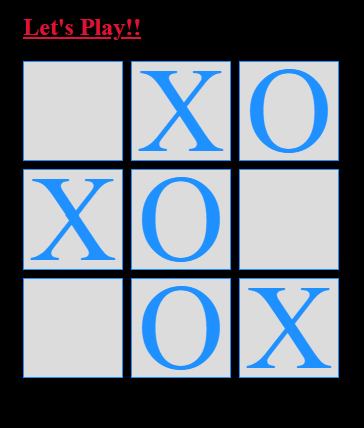
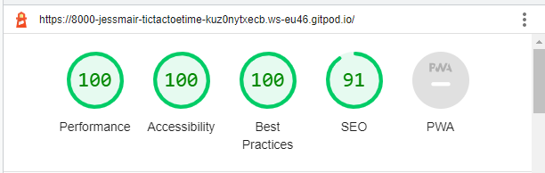

# Tic-Tac-Toe-Time - A JavaScript Project

This is my second milestone project, undertaken as part of the Code Institutes Diploma in Software Development.
Here is the link for [Tic Tac Toe Time](https://jessmair.github.io/Tic-Tac-Toe-Time/)

#  Who Is This Website For?

I have created this site for game enthusiast that enjoy simple classics such as this game "Tic Tac Toe". Better known as "Noughts and Crosses" outside of America. 
The games origins can be traced back to ancient Egypt and has had small variations of the same game through the ages. 
Although I suspect most will recall playing this classic at some point in their childhood with a pencil and some paper. 
I certainly do recall playing this game, with friends, sibling, parents, and grandparents. The beauty of this game is that it requires two players and yet can be learned by almost everyone. A game that has been shared and played over the ages, between friends and families, a true classic. I hope you enjoy visiting the site and maybe you will reminisce the days when you played a simple game of Tic Tac Toe. 

# UX - User Experience 

The project was planned in 5 stages. 

- Strategy Plane 

- Scope Plane 

- Structure Plane

- Skeleton Plane

- Surface Plane 

# The Strategy Plane 

## User Stories
-   As a user I want to be able to play the game with another person who is present in person with me
-   As a user I want see a clear set of instructions 
-   As a user I want to experience a simplistic user interface 
-   As a user I want to be able to easily navigate the game
-   As a user I want to be able to play the game repeatedly and as seamlessly as possible
-   As a user I do not want the site to be cluttered or have any information that does not serve a clear purpose in allowing me to play the game 
-   As a user I want the site to be easy to learn so that when I return in the future, the sites layout simple and easy to memorise 
-   As a user I want to be able to play this game on my mobile device and for the format to always remain tidy 

## The Owner 

-   The game should have easy to understand instructions
-   The game should be a 2-player game to be played when both players are present together, using the same device, taking turns when it is their go
-   The gameboard needs to be easy to access 
-   The user should be able to intuitively navigate the game with easy-to-follow game cues 
-   The functions of the game should be self-explanatory
-   I want the site to be fully responsive on a mobile screen as a key objective, thus making this game accessible if people wish to play it on their phone  

# The Scope Plane

The features of this project:

1 page /
A set of instructions /
A boardgame /
An alert box

When the player chooses a box, an "X" or "O" appears in the box depending on which symbols turn it is. 
An alert box message appears at the end of a game, notifying of either a winner or a draw between the players.
This alert box contains a button that reads "OK", clicking on which refreshes the page and therefore reloads the game. 

  
# The Structure Plane 

The website only has one page. The page contains the title, instructions and the boardgame itself. 
The goal of this page is to be very easy to understand and digest. Also, for someone who is familiar with the classic game of Tic Tac Toe, to be able to go straight to playing the game. 

 
 
 

The colour of the board game and the detail is complimentary with a black blackground, allowing the board and the intrsuctions to stand out in contrast.
The instructions are not overly wordy so that the game is quick and easy to move on to. 
The board is interactive too as it registers a click and prevents the player from being able to click on a cell that is already occupied.

The above images show the alert box containing a message of which player won, "X" or "O". The "OK" button is interactive.

 

The above image shows when the game ends in a draw. The "Restart" button is interactive. 

 

The above shows the screen after the "OK" button is pressed. A clean boardgame is visible. 

# The Skeleton Plane 

The design of this project was to make the content simplistic and one of the key objectives was to make the site fully responsive to a mobile screen size, as well as the bigger screen sizes. The reason being that such games are more likely to be played on mobile phones than on desktops for example.

Below is a link to the original wireframe I had completed

[Wireframe](assets/images/wireframe.jpg)

There have been some changes between the current game and the original wireframe, such as there is no live restart button or cover screen that appears prior to the game restarting. However much of the game layout and feature and functions remain the same. 

# The Surface Plane

## Colour Palette

I used the site w3schools.com's "CSS-Colours" section to select a colour combination.

 
 

I have used black for the background to create a strong contrast and layered it with a grid that is coloured in "Gainsbro" which is a grey shade. This provides a contrasted base for the game to stand out on. The "X" and "O" symbols are "Dodger Blue" and therefore stand out against the grey background, again creating a contrast and yet also being bright and eye catching to the user. The invitation to play "Let's Play" is "Crimson" red. This was selected to add another dimension of colour and to give the game a complete look of being fun and inviting. 

## Font

I have used google fonts and chose 1 font called "League Gothic". I found this font to be sharp and clear whilst imparting a nostalgia. This is something I think is fitting for a game such as Tic Tac Toe, as it is a true classic.  

## Features For the Future
Below are features that I would have liked to add but have been unable to do so yet due to time constraints and not having the knowledge to do so yet either.
-   I would like to upgrade the code to include an option of playing against the computer. This is so a person who is alone can also enjoy the game. 

# Technologies used
- [HTML5](https://en.wikipedia.org/wiki/HTML) for markup 
- [CSS3](https://en.wikipedia.org/wiki/CSS) for style 
- [Google Fonts](https://fonts.google.com/) for fonts 
- [Github]( https://github.com/) to keep the file 
- [Gitpod]( https://www.gitpod.io/) for version control
- [w3schools](https://www.w3schools.com/cssref/css_colors.asp) to build a colour palette for the site 
 

# Resources
- [Code Institute](https://codeinstitute.net/) Course material
- [Code Institute](https://codeinstitute.net/) Slack community 
- [Google Console](https://search.google.com/search-console/about) Bug fixes and testing 
- [W3C](https://validator.w3.org/) Validate HTML code
- [W3C]( https://jigsaw.w3.org/css-validator/) CSS Validation 
- [JSHint](https://jshint.com/) JavaScript Validation 
- [W3Schools](https://www.w3schools.com/) - Helped me in researching and fixing errors along the way
- [Stack Overflow](https://stackoverflow.com/) To troubleshoot many times when experincing issues 
- [Wikipedia](https://en.wikipedia.org/wiki/Tic-tac-toe) - To research the history and origind of the game 
- [Exploratorium](https://en.wikipedia.org/wiki/Tic-tac-toe.html) - For simple game rules 
- [Code Institute](https://codeinstitute.net/) For the course material and tutor support
- [YouTube](https://www.youtube.com/) Research how to make a grid 
- [Geeks For Geeks](www.geeksforgeeks.org) Research and fix errors 

# Testing

I have had more than a few errors along the way of creating this game. I tested the site after the implementation of each section. 
Along the way, I found the following errors:

- There were issues getting the winning combinations registered to the console and being checked. This took many days to resolve and in the end my mentor Spencer Barriball was able to assist me with this. 

-  Another issue was preventing the symbols from over-riding one another if the user clicked on a prepopulated box. This was resolved through creating a "let" for "usedcells" which when triggered were pushed into the index and therefore registered as occupying the cells. Thus resolving the issue. 

- The responsiveness of the game on a mobile size screen was an issue. I had to get the boardgame itself to fit in the size of a mobile screen. The board game was not fully present on the screen and the cells were very small and looked terrible to the user. After a couple of days trying to figure out the issue through media queries, I contacted tutor support and after 45 mins the issue was finally resolved. I needed to edit the original size of the board and that led to it being more responsive on the smaller screen sizes.

## User Stories Testing 
I have tested the site for achieving the goals set out in “User Stories”
-   The game is played by two players when both are present together
-   The set of instructions are clear 
-   The user interface is very simplistic 
-   The game is extremely easy to navigate 
-   The game is easy to play repeatedly and seamlessly
-   I did not find the site to be cluttered or have additional information that was not relevant to the game or serve a purpose 
-   The site is very easy to learn and memorise 
-   The game is very accessible on a mobile device and does not lose its tidy form 

## Validators 

I checked the HTML code with W3C Jigsaw and there were no errors.

I checked the CSS with W3C Jigsaw and no errors were found.

# Responsiveness 
I checked the website's responsiveness using Google Chrome Dev Tools. Mobile, tablet and desktop sizes were tested, and all worked well. 
It also responded on each breakpoint that were set up on Media Query's and no visual or functional errors found. 

I also checked the sites accessibility score using the google lighthouse tool. Below are a few images of the output showing that the site meets the standards required. 

# Version Control 

- GitHub
- Gitpod

Gitpod served as the local repository and IDE. 
GitHUb served as the remote repository. 

The following steps were followed to maintain version control;

- I created a repository on GitHub and named it 'Tic Tac Toe Time' 
- I then signed in to Gitpod and opened a new workspace via the repository name 'Tic Tac Toe Time'
- I created the pages, folders, and files on GitPod
- I saved my work on GitPod at regular intervals and pushed it to GitHub to keep it safe

This is the process I followed having completed each significant section of code, I typed the following into the terminal:
- git add . (This added the work to git)
- git commit -m "COMMIT MESSAGE" (This committed the work)
- git push (This pushed the work to GitHub)

# Deployment 

I followed the below steps on GitHub (insert link) to deploy the website. 

- Go to repository and select 'settings'. 
- Under the 'Github pages@ section, click on the live link. 
- On "Source", select "Branch: main' for Branch and click save.
- The website is now published on GitHub Pages and the link is provided on the same section

# Credits 
https://stackoverflow.com/questions/28712279/all-possible-tic-tac-toe-winning-combinations

The games winning combinations were found through stack overflow, alongside a lot of trouble shooting. 

https://www.google.com/search?q=how+to+create+a+3+x+3+grid+on+html&rlz=1C1CHBF_en-GBGB803GB803&oq=how+to+create+a+3+x+3+grid+on+html+&aqs=chrome..69i57j33i10i160l4.10192j0j7&sourceid=chrome&ie=UTF-8#kpvalbx=_O0CNYo7LDNPB8gLr_Zi4Aw15

I used this video for a reference of how to make a grid 

https://www.geeksforgeeks.org/how-to-find-if-two-arrays-contain-any-common-item-in-javascript/

This site helped in figuring out the code of how to detect common arrays 

And last but certainly by no means least, the greatest credit goes to my mentor Spencer Barriball who took a great deal of time out to help me fix errors and solve some complicated issues with the game. I am forever grateful for Spencer's mentorship.
 
